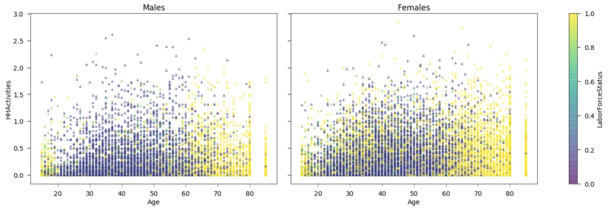
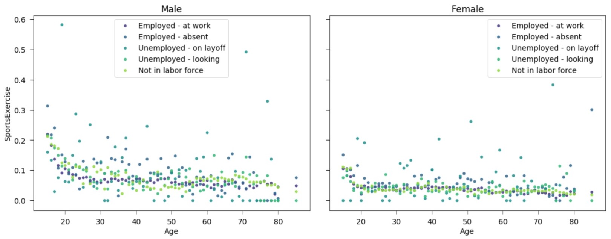

# SubGroupExplorerTool_DataViz_CS765

A tool meant to aid in sub group exploration: designed to find interesting and valid subgroups in a dataset as well as present multivariate visualizations of those subgroups. 

## Building and Running:

- You should be able to import the Explorer.py class and access all methods using standard Python 3
- The dependanceies are all very standard and are as follows:
    - pandas
    - numpy
    - scipy
    - matplotlib
    - sklearn
    - math
    

## Data:

There are four example data sets provided for the user in the repository, both full and subset verisons. Examples of how to use all four are provided in the tutorial notebook.
In general the data should be of CSV format, with the first row labeling the type of data for the column ("Categorical", "Ordinal", "Interval", and "Ratio"), this may require a bit of pre-processing. The second row should be the headers, and all other rows should be the data. 

## Tutorial Notebooks:

Two different notebooks exist. 

1. "Tutorial 1 (Full) USCensus ACS 2019 Wisconsin": This notebook showcases every function available in the class and how to use each. It relies on both ACS data sets. There are many annotations as well describing the functionality of the code and the data analysis methodology that you might want to follow. This is the primary notebook to explore!

2. "Tutorial 2 (Exploritory) AmericanTimeUsageSurvey": This is a supplementary notebook using the other two data sets provided and was used to validate the tool. It goes through a less complete but more realistic use of the tool in order to pull out some interesting results. Below are some examples of the multivariate comparison plots that were produced with it. 

## Example Multivariate Sub Group Comparison Plots: 

Time spent on house hold activites vs age for males and females colored by Labor Force Status:

Time spent on Sports/Exercise vs age for males and females colored by Labor Force Status:

